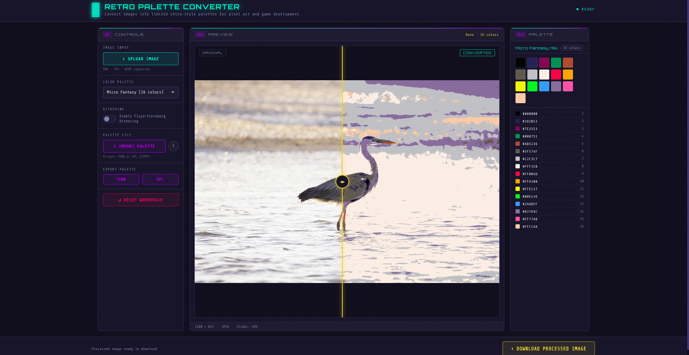

# Retro Palette Converter

Retro Palette Converter is a lightweight browser-based tool for converting images into limited retro-style color palettes.

It was designed for pixel artists, indie game developers, and anyone interested in experimenting with classic color limitations used in early digital graphics.

The tool runs entirely in the browser — no installation or backend required.

---


## Features

- Upload images and preview instantly
- Convert images to limited retro-style palettes
- Optional dithering for classic pixel aesthetics
- Interactive before / after comparison slider
- Built-in palette preview
- Import custom palettes (JSON or GPL format)
- Export palettes for reuse
- Download processed image as PNG

---
## Video Demo

See the tool in action:

[](https://www.youtube.com/watch?v=gmD3B3RsQdg)


## Example

Below is a simple before / after conversion using a limited retro palette.




---

## Palette Import

The tool supports importing palettes in two formats:

### JSON

Example:

```json
{
  "name": "My Palette",
  "colors": [
    "#000000",
    "#FF0000",
    "#00FF00",
    "#0000FF"
  ]
}
```
GPL (GIMP Palette)

Standard GIMP palette format:

```json
GIMP Palette
Name: Example
#
255 0 0 Red
0 255 0 Green
0 0 255 Blue
```

## How It Works

The converter performs **color quantization** by mapping each pixel to the nearest color in the selected palette.

An optional **Floyd–Steinberg dithering algorithm** can be applied to simulate additional color depth and produce classic retro-style textures.

All image processing runs **locally in your browser** using the Canvas API. No files are uploaded or processed on external servers.

---

## Use Cases

- Pixel art experimentation  
- Retro game development  
- Palette testing for indie projects  
- Rapid color reduction for retro aesthetics  
- Game jam prototyping  

---


## License
This project is licensed under the MIT License - see the [LICENSE](LICENSE) file for details.
Example photo from pixabay.


